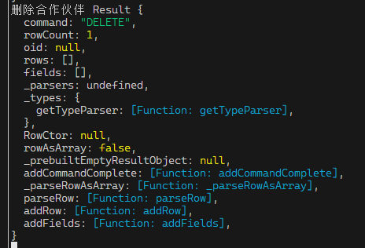

这是删除返回的对象

 1. ​Drizzle 的表定义：不要叫 schema，而叫 table


---

## ✅ 一、你当前的规范总结（非常棒的基础！）

| 用途 | 命名方式 | 后缀/风格 | 示例 | 说明 |
|------|----------|-----------|------|------|
| **Drizzle 表定义** | `xxxTable` | 驼峰 | `usersTable` | 表示数据库表，语义清晰，区别于 Zod |
| **Zod 校验规则（运行时校验）** | `xxxSchema` | 驼峰 | `selectuserTable`、`insertuserTable` | 用于请求/返回校验，不与 Drizzle 混淆 |
| **Zod 推断出的类型（返回类型）** | `SelectUserType` | **大驼峰** | `SelectUserType` | 如果没有多表联查，可加 `Vo` 后缀，如 `SelectUserVo`，作为返回给前端的类型 |
| **返回给前端的类型（查询结果）** | `SelectUserVo` | **Vo 后缀 + 大驼峰** | `SelectUserVo` | 表示“视图对象”，适合表格、页面展示，推荐加 `Vo` |
| **前端请求用的类型（插入/更新）** | `InsertUserDto` / `UpdateUserDto` | **Dto 后缀 + 大驼峰** | `InsertUserDto` | 提供给前端用于提交数据的类型，语义明确 |
| **类型命名风格** | - | - | - | Zod 推断类型默认用 `type SelectUserType = z.infer<...>`，但你可以手动再包装一层，命名为大驼峰，如 `SelectUserVo` |

---


## 🧩 三、我可以为你进一步完善与补充这个规范，让它更严谨、更通用、更可扩展


### ✅ 【1】命名规范补充与统一建议

| 类型 | 你的当前命名 | 我的建议（优化/补充） | 说明 |
|------|---------------|------------------------|------|
| **Drizzle 表定义** | `xxxTable` ✅ | 保持 `xxxTable` 或也可接受 `xxxEntity` | 推荐保持，语义明确，和 Zod/类型区分开 |
| **Zod 校验对象（运行时校验）** | `xxxSchema` ✅ | 保持 `xxxSchema`（驼峰） | 比如 `insertuserTable`、`selectuserTable`，用途清晰 |
| **Zod 推断类型（运行时类型）** | `type SelectUserType = ...` | 可以保持，但建议再包装为 `SelectUserVo`（大驼峰）用于返回前端 | 推荐为查询类结果统一使用 `Vo` 后缀，即使没有多表 |
| **返回给前端的类型（查询结果）** | 可无 / `SelectUserType` | ✅ 推荐命名为 `SelectUserVo`（大驼峰 + Vo 后缀） | 表示“视图对象”，适合返回给前端展示，特别是表格、列表 |
| **前端提交的请求类型（新增/修改）** | 可无 / `InsertUserType` | ✅ 推荐命名为 `InsertUserDto`、`UpdateUserDto`（大驼峰 + Dto 后缀） | 明确是数据传输对象，用于 API 请求 |
| **类型命名风格** | 驼峰 or 大驼峰 | **建议：Zod 推断类型保持驼峰（可选），但对外类型（Dto / Vo）统一用大驼峰** | 大驼峰更适合表示“类型/类”，和接口文档、OpenAPI 更契合 |
---


#### ✅ 每个模型一个文件（推荐！）：`user.model.ts`
```ts
// src/models/user.model.ts

// 1. Drizzle 表定义
export const usersTable = pgTable('users', { ... });

// 2. Zod 校验规则（运行时校验）
export const insertuserTable = createInsertSchema(usersTable, { ... });
export const updateuserTable = createUpdateSchema(usersTable, { ... });
export const selectuserTable = createSelectSchema(usersTable);

// 3. 类型定义（可选，但推荐）
// 类型来源于 Zod 推断，但用更语义化的名字导出
export type InsertUserDto = z.infer<typeof insertuserTable>;  // 请求用
export type UpdateUserDto = z.infer<typeof updateuserTable>;  // 请求用
export type SelectUserType = z.infer<typeof selectuserTable>; // 查询返回原始类型

// 4. 推荐再包装一层，用于前端展示（加 Vo 后缀，大驼峰）
export type SelectUserVo = SelectUserType; // 可直接复用，或扩展字段（比如格式化日期等）
```

> ✅ 这样前端只需要关心：
> - `InsertUserDto`（新增请求用）
> - `UpdateUserDto`（修改请求用）
> - `SelectUserVo`（展示用，比如返回给表格）

---

### ✅ 【3】多表联查时的 Vo 命名建议
当你的查询涉及 **多表联查 / 关联数据**，比如 `user + posts`，建议：
- 命名为：`UserWithPostsVo`、`UserDetailVo` 等
- 表明这是一个 **复合视图对象**，用于前端展示更复杂的页面

```ts
export type UserWithPostsVo = {
  user: SelectUserVo;
  posts: PostVo[];
};
```

> ✅ 这种 Vo 命名能清晰表达“这是一个组合视图，用于渲染页面或表格详情”

---

### ✅ 【5】边界情况处理建议

| 场景 | 建议 |
|------|------|
| **不想手动写 Vo / Dto，直接用 Zod 推断类型？** | 可以，但建议至少用 `type SelectUserVo = z.infer<...>` 包装并重命名，提升可读性 |
| **联表查询复杂，返回对象嵌套深？** | 建议使用 `UserDetailVo`、`UserWithOrdersVo` 等命名，表明是组合对象 |

---
## ✅ 四、最终推荐规范总结（结合你的想法 + 我的优化）

| 用途 | 命名风格 | 推荐命名示例 | 后缀 | 说明 |
|------|----------|---------------|------|------|
| **Drizzle 表定义** | 驼峰 | `usersTable` | `Table` | 表示数据库表，语义清晰 |
| **Zod 校验规则（插入/更新/查询）** | 驼峰 | `insertuserTable`、`selectuserTable` | `Schema` | 用于运行时校验 |
| **Zod 推断类型（原始查询结果）** | 驼峰（可选） | `SelectUserType` | `Type` | 可直接用，但推荐再包装 |
| **返回给前端的查询类型（推荐）** | 大驼峰 | `SelectUserVo` | `Vo` | 表示视图对象，用于页面/表格展示 |
| **前端提交的数据类型（插入/更新）** | 大驼峰 | `InsertUserDto`、`UpdateUserDto` | `Dto` | 表示数据传输对象，用于 API 请求 |
| **多表联查返回类型** | 大驼峰 | `UserWithPostsVo`、`UserDetailVo` | `Vo` | 表示组合视图，适合详情页/复杂UI |
---


